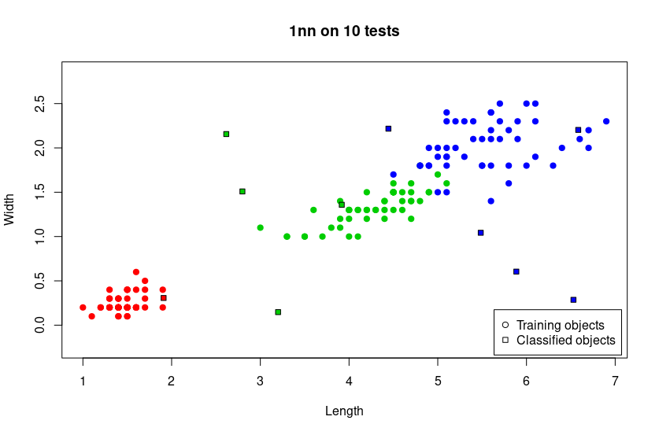

Эта программа представляет собой реализацию алгоритма одного ближайшего соседа (1NN) для задачи классификации на датасете Iris на языке R.
Принцип алгоритма состоит в том, чтобы используя гиоптезу компактности, определить класс объекта, в зависимости от других объектов 
в признаковом пространстве.

Код алгоритма на языке R:
```R
nn <- function(data, u)
{
    # This function gets the data and a point and returns
    # the class of the nearest one or -1 if there are no neigbors.
    row <- dim(data)[1]
    col <- dim(data)[2]
    min_dist <- Inf
    nearest <- -1
    for(i in 1:row)
    {
        curr_dist <- euclidian_dist(data[i, 1:col-1], u)
        if(curr_dist < min_dist)
        {
            min_dist <- curr_dist
            nearest <- i
        }
    }
    return (data[nearest, col])
}
```
Результат программы отображается на графике, где круглые точки - это объекты из тренировочной выборки датасета Iris,
а квадратные точки - это объекты из тестововй выборки.
</img>
